# Classification-of-Sugar-Beet-Growth-Phases-UsingSynthetic-Data-in-Yolo-v4
In  this  project,  classification  system  has  predicteddifferent  growth  phases  of  synthetic  images  of  sugar  beet  usingstate  of  an  art,  real-time  object  detection  model  (Yolo  v4).  Toachieve this task, Blender is used for the creation of sugar beet’s3D  models  and  Unreal  Engine  4  for  the  simulation  in  different environments. 

There are four types of 3D models according to their growth phase which is then placed in a simulated environment in Unreal Engine for the acquisition of images.
Unreal engine is used to simulate a farm-like environment for acquisition training images. This training data is used for the
training and validation process for Yolo net. In the end, 3D models of sugar beet in a simulated environment have produced
substantial results which proved that synthetic data can be used for real-life application of object detection.

In this project, state-of-the-art Yolo v4 net  was deployed
for the classification of the age of the sugar beet plant in
real-time. For training and validation purposes, four classes of
3D models of sugar beet were designed in Blender software
and deployed in an Unreal Engine environment with variable
weather settings. A camera is attached to the tractor in
a simulated environment which records the video of beets
planted in soil. Extracted images are labeled from the video
and feed them to Yolo net for training and validation processes.
The optimal goal of this project is to achieve the substantial
percentage of Mean Average Precision (m.A.P) in Yolo net by
using synthetic data.

To achieve this goal, pipeline is divided
this pipeline into IV parts. Part I is designated for the creation
of 3D models of sugar beets according to their age group.
In part II, these 3D models are placed into the Unreal Engine
farm environment. This simulation provides two sets of videos
where one video is in general RGB format and the second
video is in black and red segmented format. This pixel-wise
segmented format is provided by the Unreal engine. In part III,
original RGB image are labeled by using a segmented image,
through the OpenCV library. In part IV feed Yolo net with
these labelled images for the training and validation purpose.

## Project Pipe line 

This section discusses the complete pipeline of our project.
The first task in our pipeline is to create a 3D model of
sugar beet. These models are categorized according to their
age. there are four phases (0-4) for each 3D model. Blender
software is used for the modeling of these sugar beets. For the
textures of leaves, real texture is captured from a video of a
sugar beet farm. In this way, there is no need to create texture
from ground zero. These textures are then mapped to the leaf
model of the sugar beet to create a sense of realism. After
creating five models of sugar beet in Blender software, then
import the .fbx files of these models in the Unreal Engine 4
for farm simulation.
In Unreal Engine 4, farm simulation is designed with vari-
able weather. This simulation gives control over every detail
like weather, soil texture, plant spacing, air pressure, terrain
adjustment, etc. Tractor model is also constructed which will
drive from one point to other points in the field. The path
of tractor movement is selected by the user. After the path
selection, camera is attached to the tractor which will take
images of sugar beet planted in the soil. The parameters of a
camera will be discussed later.

  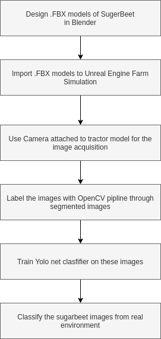

### Camera Setup

The camera is the most important component in this sim-
ulation which is used for the image acquisition of sugar beet
plants. The project mode of the imaging system is set as
”Perspective” and Field of View is set around 90 ◦ . The reason
for 90 ◦ is the capture most of the ground without the fish-
eye lens effect. The aspect ratio is set around 1.777 but it
can be changed according to requirements. This camera setup
provides sharp images of sugar beet planted in the soil. The
distance between soil and camera is around 1.5 meters.

### 3D models of Sugar Beet

To create a simulation in Unreal Engine, a 3D model of
sugar beet is designed in Blender. This is the best tool available
for 3D modeling and designing. With the help of this tool, 5
phases of sugar beet are created. These 5 phases are according
to their growth stages.

  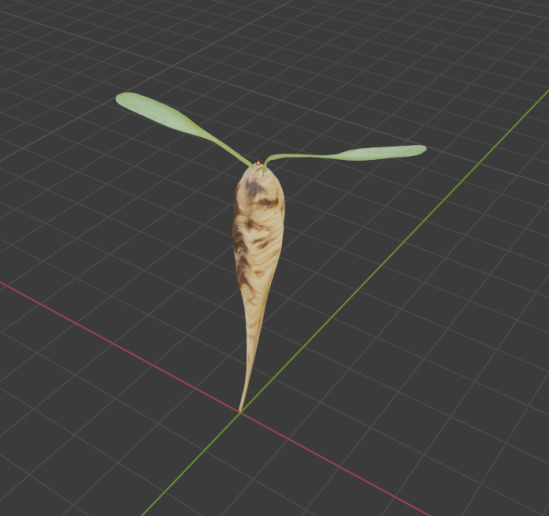

Phase 0 refers to the initial growth stage which is very
early in development. This stage has very small leaves and
a vertically longer beetroot.

  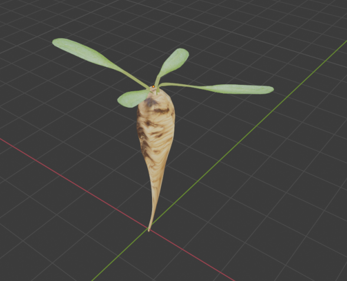

Phase 1 refers to the early stage of growth with 4 leaves. In
this setting, two leaves are longer than the other two leaves.
The beetroot is slightly bigger than the phase 0 beetroot.

  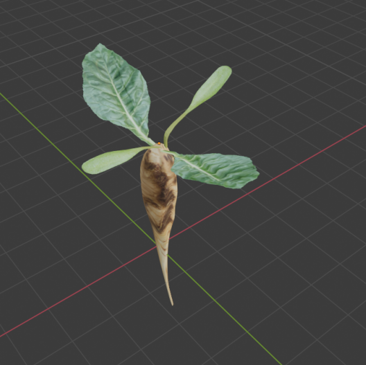

In phase 2, mature leaves are compared to the last stage’s
leaves. The beetroot is more elongated as compared to the
phase 1 beetroot.
The main flower is 20 % open and leaves are starting to get
a yellowish-green color. All 4 leaves are properly unfolded.
This growth is also named Rosette growth.

  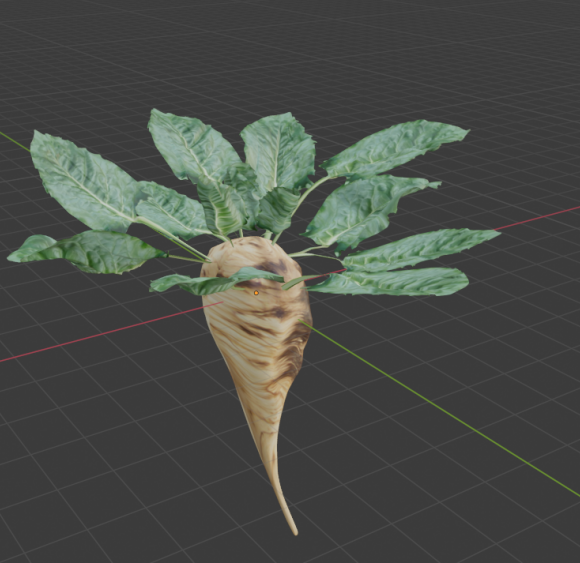

Phase 4 is the fully grown stage where the leaves are
in perfect condition. Beetroot has reached harvest-able size.
The main flower is fully grown and open. The main stem
is approximately 20 cm long and leaves cover 90 % of the
ground. After the modeling and designing of all the phases
of sugar beet, object is the planted into the soil of simulated
environment in Unreal Engine. This simulation provides the
opportunity to create any field with any terrain of sugar beet
lines. The muddy texture of soil can also be used to get
the rainy environment. All of the weather conditions can be
simulated using UE. This allows to create diverse data with
very high variability. The size of sugar beet model can be
increased/decreased to get high-quality data in real-time.

  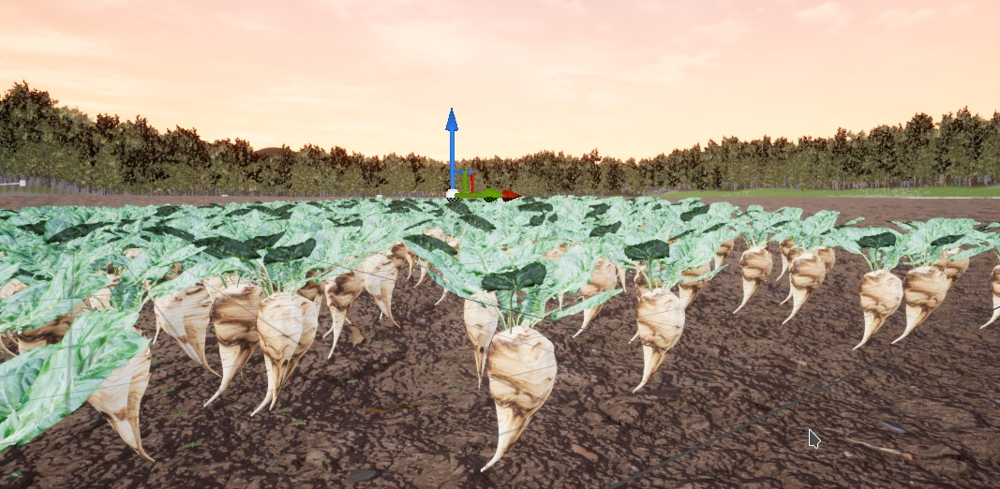

### Segmentation in Unreal Engine

Segmentation of images plays a cerebral role in labeling.
Yolo net requires a special format of labeling in order to
train itself. The 3D models of sugar beet are being designed
and planted in the simulated farm in Unreal Engine. This
environment provides freedom to play around with the settings
and generate any amount of data under any condition. This
freedom allows to color every pixel that belongs to sugar beet’s
.FBX model with red and rest of the pixels will be colored
black. This technique is crucial to create the segmented image
of the normal RGB image. The unreal engine also provides
segmented images which are very beneficial for labeling data.
By using the ”Sequencer” tool in Unreal Engine, cinematic is
created from a farm environment. In this cinematic, images
are acquired with a resolution of 416 by 416. Yolo net requires
the resolution of training images with a multiple of 16 which
is the resolution of 416*416 is selected.

  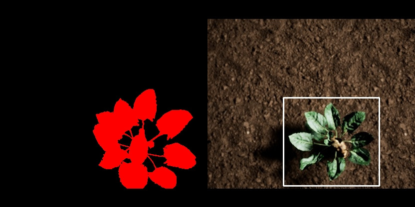

  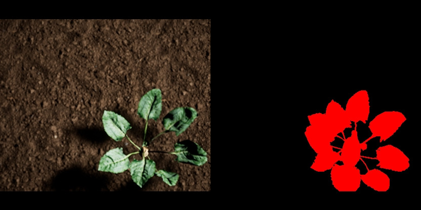

### Training and Evaluation

There are 11500 data images (divided into 5 classes) col-
lected from the farm field environment. 75% of data is then
used for training and 25% is used for validation. The Tesla
P100 GPU is used with 27 GB ram in the google colab
environment. This GPU has allows to train with high volume
of data in a reasonable short span of time. After the training,
a chart is generated which shows the graphs of Mean Average
Precision(mAP) and Average Loss.

  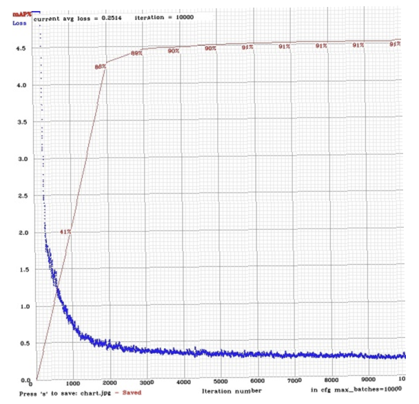

### Results 

After collecting data from simulation in an unreal engine
environment, Yolo network is trained and validated. To check
the classification accuracy, real-time data of sugar beet from
the internet is collected and tested on Yolo network. With 92%
mAP, a good score against this unseen data is achieved.

  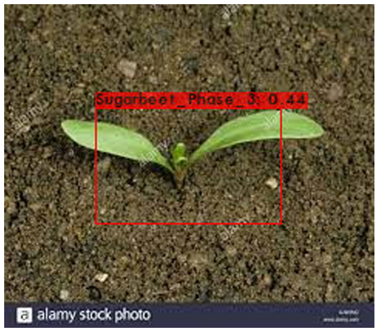

Due to the small distance between camera and object
appears very large. This anomaly results in classification errors
of the network

  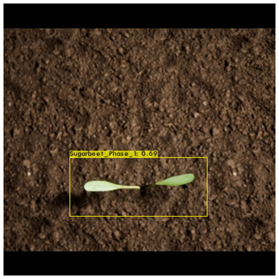

This test data is from simulated farmland in an Unreal
engine. As it can be seen that it has correctly classified the
growth stage of the sugar beet.

  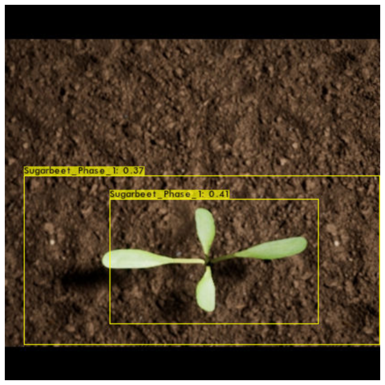

  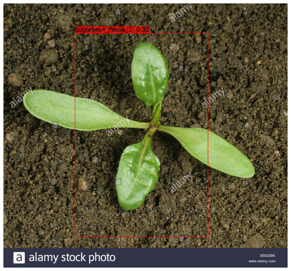

  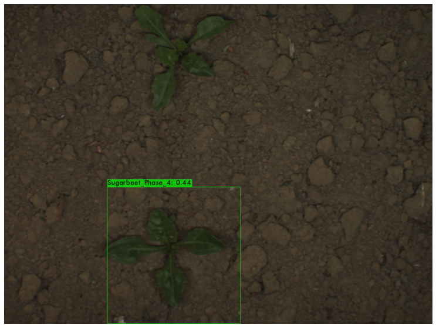

A perfect classification score is achieved for the
stage 4 sugar beet test data. This data point is from a real-
time control environment with almost no sunlight. Even due
to these shortcomings, the network is still able to classify the
object.

  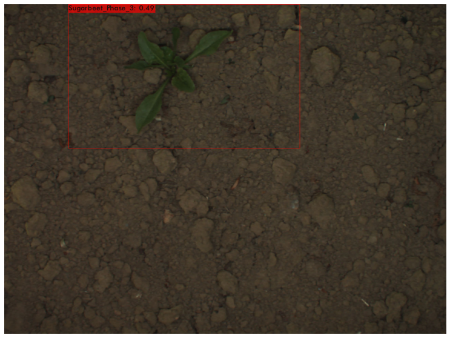

